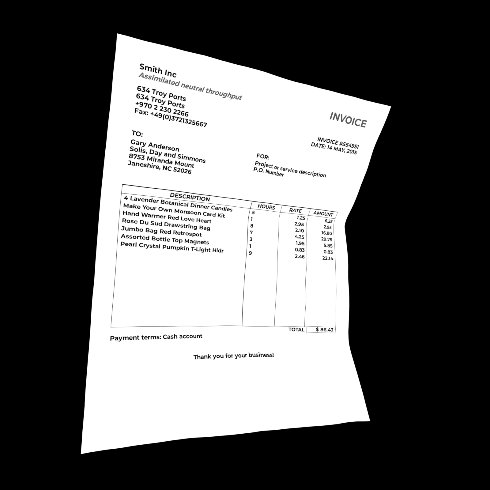
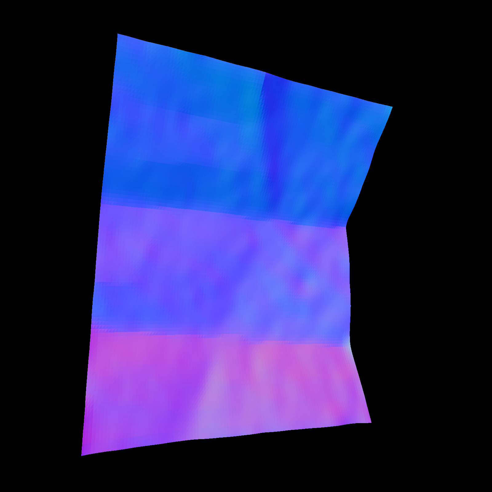
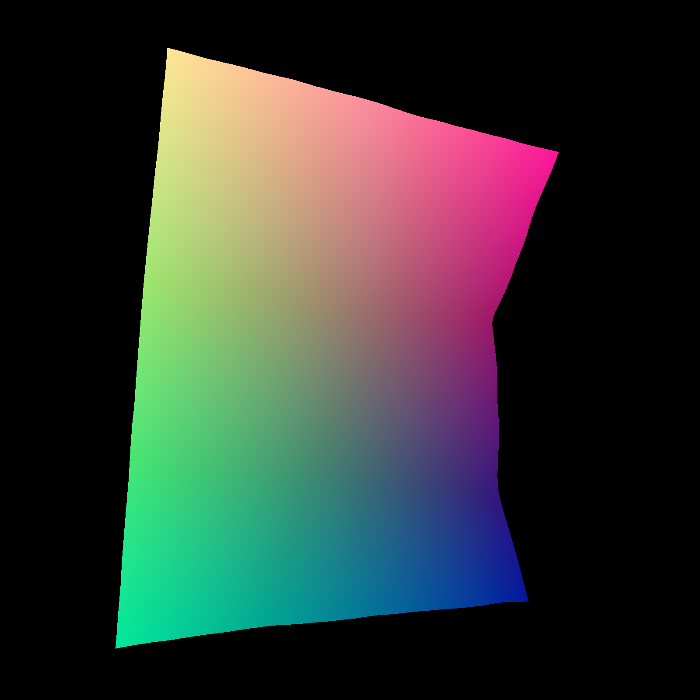

# Inv3D Dataset Generation

Create your own version of the Inv3D dataset!

This repository contains the dataset generation code of our [paper](https://link.springer.com/article/10.1007/s10032-023-00434-x) which has been accepted at the International Conference on Document Analysis and Recognition ([ICDAR](https://icdar2023.org/)) 2023.

For more details see our project page [project page](https://felixhertlein.github.io/inv3d).


## Installation 

### Download external ressources
For the dataset generation, your need the following ressources:
- Warped paper meshes (download [samples](https://github.com/sagniklp/doc3D-renderer/tree/master/obj) orj [full dataset](https://github.com/cvlab-stonybrook/doc3D-dataset))
- Company logos (download [here](https://data.vision.ee.ethz.ch/sagea/lld/))
- HDR envrionment maps (download [samples](https://github.com/sagniklp/doc3D-renderer/tree/master/env) or [full dataset](http://www.hdrdb.com/indoor/) [currently offline, see [issue](https://github.com/FelixHertlein/inv3d-generator/issues/1)])
- Fonts (already in this repository)
- Document templates (already in this repository)

All ressources must be placed in the corresponding asset folder within the top-level directory "assets".
The asset integration can also be done using docker mounts to avoid copying these inside the container.

### Build docker image

```console
docker build -t inv3d-generator PATH_TO_REPOSITORY
````


## Getting started
### Start dataset generation
```console
docker run \
--cpus=8 -it \
--init \
--mount source=inv3d-volume,target=/usr/inv3d/out \
inv3d-generator \
--num_workers 4 \
--num_samples 10 \
default \
--resolution_rendering 448 \
--seed 42 \
--document_dpi 150
```

### Resume dataset generation
```console
docker run \
--cpus=8 -it \
--init \
--mount source=inv3d-volume,target=/usr/inv3d/out \
--entrypoint python \
inv3d-generator \
-u src/resume.py --num_workers 4
```

## Sample Files

| Preview                                                    | Name | Resolution |     Dtype     |     Value Range     | Description |
| :----------------------------------------------------------- | :--: | :--------: | :----------: | :--------: | ---------- |
|   |   flat_document.png   | 1755x1240x3<br />(150dpi) |  uint8  | 0-255     | Complete document in perfect condition.                      |
|  |    flat_information_delta.png  | 1755x1240x3<br />(150dpi) |  uint8  | 0-255     | Displays all texts which represent invoice data              |
|   |    flat_template.png  | 1755x1240x3<br />(150dpi) |  uint8  | 0-255     | Empty invoice template                                      |
|  |    flat_text_mask.png  | 1755x1240x3<br />(150dpi) |  uint8  | 0-255     | All texts shown in given document.                           |
|   |    warped_angle.png  | 448x448x2 |  float32  | -Pi-Pi     | Angle rotation of x- and y-axis induced by the warping.                                                   |
|   |    warped_albedo.png  | 448x448x3 |  uint8  | 0-255     | Albedo map                                                   |
|   |   warped_BM.npz   | 448x448x2 | float32 | 0-1       | Backward mapping. Defines for each pixel the relative pixel shift from warped to normalized image. |
|   |   warped_curvature.npz   | 448x448x1 | float32 | 0-inf | Pixel-wise curvature of the warped document. |
|  |  warped_depth.npz    | 448x448x3 | float32 | 0-inf     |      Depth per pixel between camera and document |
|  |   warped_document.png   | 448x448x3 |  uin8   | 0-255     | Warped document image                                        |
|  |   warped_normal.npz   | 448x448x3 | float32 | -inf-inf  | Normals of warped document                                   |
|    |    warped_recon.png  | 448x448x3 |  uin8   | 0-255     | Warped document using a chess texture.                       |
|    |    warped_text_mask.npz  | 448x448x1 |  bool8   | True;False     | Boolean mask indicating text pixels.                       |
|   |  warped_UV.npz    | 448x448x3 | float32 | 0-1       | Warped texture coordinates. |
|   |  warped_WC.npz    | 448x448x3 | float32 | -inf-inf  | Coordinates in the 3D space. |


## Citation

If you use the code of our paper for scientific research, please consider citing

```latex
@article{hertlein2023inv3d,
	title        = {Inv3D: a high-resolution 3D invoice dataset for template-guided single-image document unwarping},
	author       = {Hertlein, Felix and Naumann, Alexander and Philipp, Patrick},
	year         = 2023,
	journal      = {International Journal on Document Analysis and Recognition (IJDAR)},
	publisher    = {Springer},
	pages        = {1--12}
}
```

## Acknowledgements

This work is based on the dataset generation of [Doc3D](https://github.com/sagniklp/doc3D-renderer/tree/master).

## Affiliations

<p align="center">
    
</p>

## License

This project is licensed under [MIT](LICENSE) unless another license is specified in a given subfolder.

